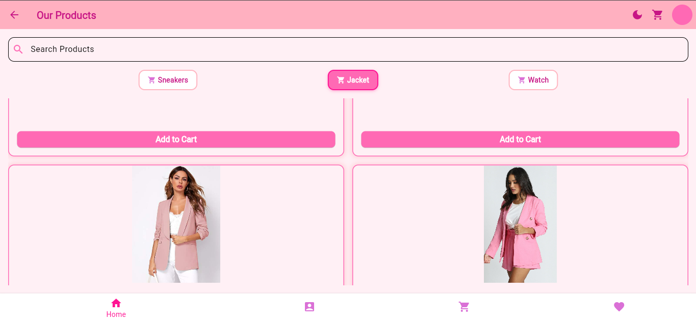

# 💖 Girly Shop - E-Commerce App 🛍️  

An **E-Commerce Flutter Application** designed for **fashion & accessories** with a girly theme (pink-inspired UI).  
The app includes **Sneakers, Blazers, Watches, and Girly Fashion** items – styled in multiple shades of pink 🌸.  

---

## ✨ Features
- **User Authentication**
  - Login & Register with Email/Password  
- **Firebase Firestore**
  - Store user profiles, orders, and favorites  
- **API Integration** (DummyJSON)  
  - Fetch products & categories dynamically  
- **State Management**
  - Manage cart, wishlist, and authentication state globally  
- **Persistence**
  - Save cart and login session with SharedPreferences/Hive  
- **Push Notifications**
  - Notify users for new offers or successful orders  
- **Responsive UI**
  - Works on both Android & Web  

---

## 🖥️ Tech Stack
- **Flutter** (UI)  
- **Firebase** (Auth + Firestore + Notifications)  
- **HTTP / Dio** (API requests from [DummyJSON](https://dummyjson.com/))  
- **State Management** (Provider / Riverpod / GetX)  

---

## 📸 Screenshots  





---

## 🚀 Installation & Run

1. **Clone the repo**
   ```bash
   git clone https://github.com/your-username/girly-shop.git
   cd girly-shop
